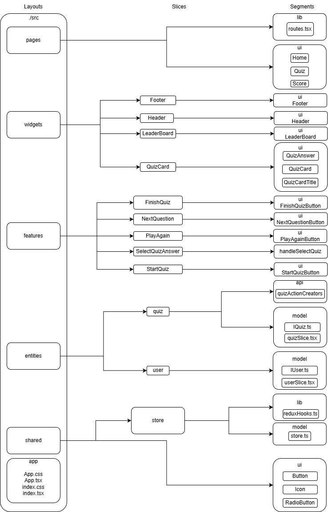

# 365scores-quiz


## Contents
- [Application architecture](#Application-architecture)
- [Design decisions](#Design-decisions)
- [State management](#State-management)
- [Component structure](#Component-structure)
- [Running locally](#Running-locally)
- [License](#License)

## Application architecture

<a href="./Application-architecture.png">
  
</a>

Application is a single repository monolith, consisting of frontend written in [React](https://react.dev/) 
and a micro backend using [json-server](https://www.npmjs.com/package/json-server) library.
I developed the frontend side of application using [FSD](https://feature-sliced.design/) methodology with some 
simplifications. For example, the app layer is missing because I didn't want to bother with ejecting webpack.config.
Although, of course, in the future, as the application grows, it would be worth doing this.
Also, the processes layer is missing witch is actually good because it is already deprecated. Features layer is missing.
Inside pages layer we have ui and lib segments without slices.

Application layers:
- pages - large parts of a page in nested routing in our example that are `Home`, `Quiz` and `Score`
- widgets - large self-contained chunks of functionality or UI, in our case that are: `QuizCard` and `Leaderboard` components
- entities - business entities that the project works with: `User` and `Quiz`
- shared - reusable functionality, especially when it's detached from the specifics of the project/business

Folders inside every layer divide the layer by domain and by FSD it's called slices. 
Also, every slice and shared layer is divided by segments: ui, model and api.

To speed up the development process, it was decided to use anonymous sessions:
- 1️⃣ On the user's first visit, a unique user id is generated
- 2️⃣ This id is stored in the local storage and state
- 3️⃣ On the next visit user's id would from local storage taken

Also, due to time limits Components were not 
divided into [presentational and container](https://medium.com/@dan_abramov/smart-and-dumb-components-7ca2f9a7c7d0), 
eslint was not configured and there is ability to see only current user's score.

## Design decisions
Due to development time constraints and overall small size of the application, it was decided 
to use [materialize-css](https://materializecss.com/) as the main style library.
Although of course `MUI` and `ANTD` are more popular now, it seemed to me that this would be too much for a small project.

## State management
I decided to use [RTK](https://redux-toolkit.js.org/) for state management because I wanted to have a centralized state 
and the ability to see when, where, and how the application's state changed.

## Component structure
High level components (`Header`, `Footer` and of course `Home / Quiz / Score` through router) are gathered inside `App.tsx`.
Reusable components that have no business logic or domain specifics (like buttons, icons) are placed inside shared 
folder and takes everything they need through props.

## Running locally
All the following commands should be executed from the root folder of the project.
1. Install dependencies for running scripts from root directory:

```bash
npm ci
```

2. Install dependencies for backend and frontend

```bash
npm run install
```

3. Start both frontend and backend with single command

```bash
npm run dev
```

## License

Licensed under the MIT license.